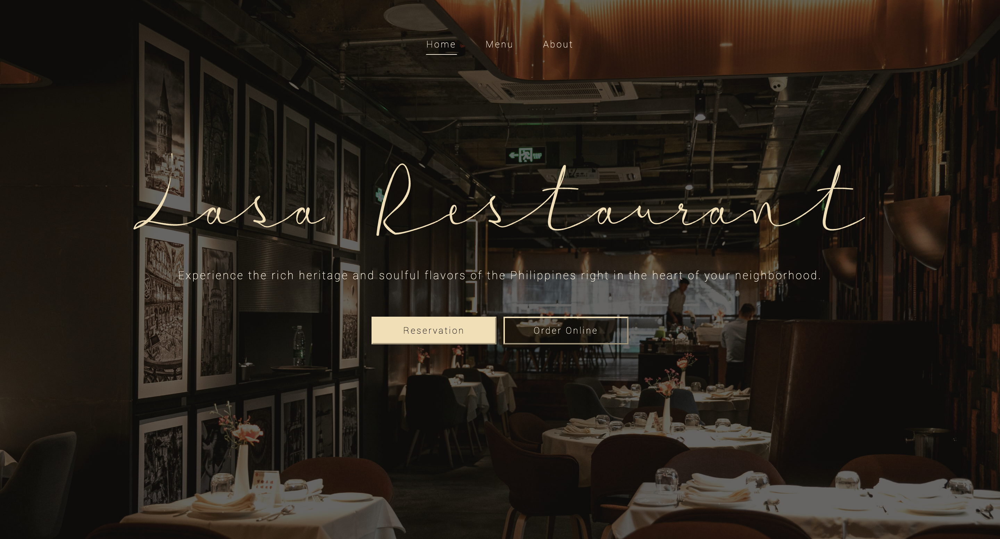
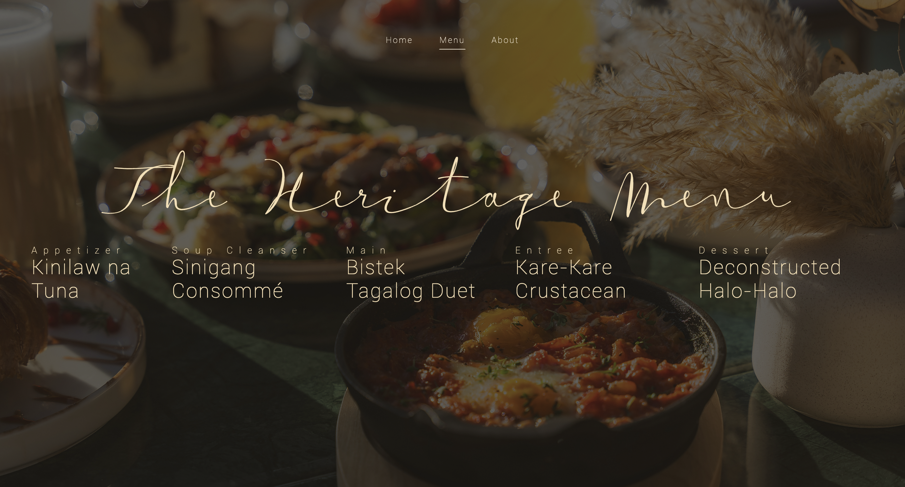
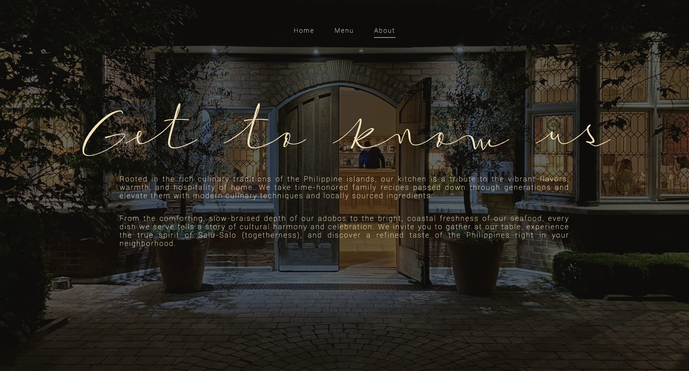

# restaurant-page

Live preview can be found <a href="https://motokaneyuki.github.io/restaurant-page/">here</a>.

## Overview
This is a responsive, multi-tab restaurant website built using JavaScript modules. 

Instead of loading separate HTML pages, the website dynamically clears and rebuilds the main content container using JavaScript.

To give the project a unique and elegant touch, I designed it around a high-end Filipino concept featuring curated multi-course menus and a dark aesthetic overlay.

## What I learned

- ES6 Modules (`import` and `export` syntax)
- Using Webpack as a build tool to bundle assets
- Managing application state for active tab navigation
- Implementing absolute dark overlays in CSS
- Dynamic DOM element creation and appending using JS
- Keeping a clean commit history with concise messages
- and more

## Attributions
Photo by <a href="https://unsplash.com/@igorrand?utm_source=unsplash&utm_medium=referral&utm_content=creditCopyText">Igor Rand</a> on <a href="https://unsplash.com/photos/restaurant-close-up-photography-wfM1Fi-kMaY?utm_source=unsplash&utm_medium=referral&utm_content=creditCopyText">Unsplash</a>

Photo by <a href="https://unsplash.com/@juvellin_media?utm_source=unsplash&utm_medium=referral&utm_content=creditCopyText">Nico Ruzin</a> on <a href="https://unsplash.com/photos/a-table-topped-with-lots-of-different-types-of-food-rC3iOOPHja8?utm_source=unsplash&utm_medium=referral&utm_content=creditCopyText">Unsplash</a>

Photo by <a href="https://unsplash.com/@armand_khoury?utm_source=unsplash&utm_medium=referral&utm_content=creditCopyText">Armand Khoury</a> on <a href="https://unsplash.com/photos/a-building-with-a-brick-patio-and-a-brick-walkway-OVeihXMzQHA?utm_source=unsplash&utm_medium=referral&utm_content=creditCopyText">Unsplash</a>

<a href="https://www.fontspace.com/xanas-weddinggroom-demoof22styles-seeall-font-f157102">Xanas Wedding Font</a> by Pedro Teixeira Foundry

Roboto Font by Google